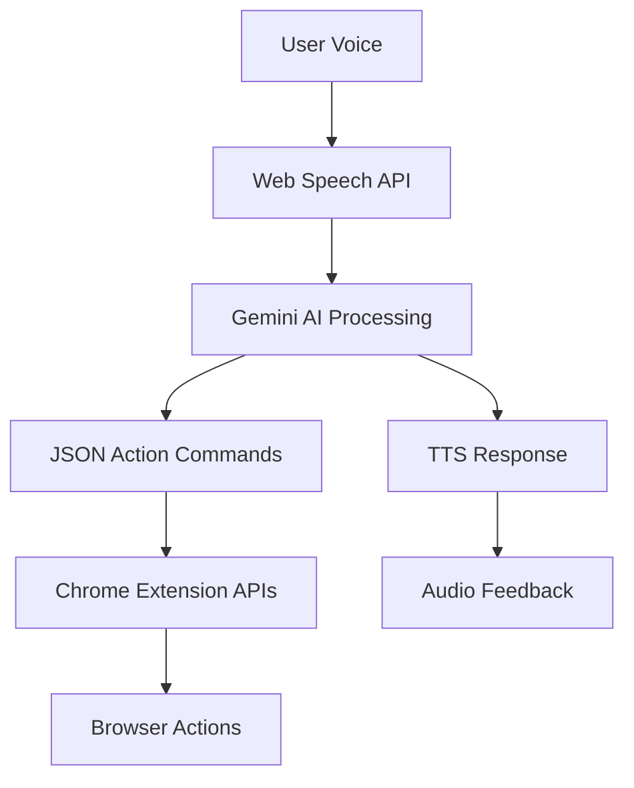

# 🤖 Goofy AI Voice Browser Assistant

> A playful AI voice assistant that controls your browser with natural language commands!


## ✨ What is Goofy?

Goofy is an AI-powered Chrome extension that transforms your browser experience through voice commands. Simply speak naturally, and Goofy will:

- 🎯 **Understand your intent** using Google's Gemini AI
- 🎬 **Execute browser actions** like opening tabs, searching, scrolling
- 🎭 **Respond with personality** - because AI should be fun!
- 🎨 **Learn from context** - no rigid command structures needed

## 🚀 Quick Start

**⚡ Get running in 5 minutes!** See our [QUICK_START.md](./QUICK_START.md) guide.

### Prerequisites
- Chrome browser
- Node.js 16+ installed
- A Google Gemini API key ([Get one here](https://makersuite.google.com/app/apikey))

### Installation

1. **Clone and setup:**
   ```bash
   cd goofy
   npm install
   ```

2. **Configure API key:**
   ```bash
   # Create .env file
   echo "VITE_GEMINI_API_KEY=your_actual_api_key_here" > .env
   ```

3. **Build the extension:**
   ```bash
   npm run build
   ```

4. **Load in Chrome:**
   - Open `chrome://extensions/`
   - Enable "Developer mode"
   - Click "Load unpacked"
   - Select the `dist` folder

5. **Start using:**
   - Click the Goofy extension icon
   - Click the microphone button
   - Say: "Hey Goofy, open YouTube!"

## 🎯 Perfect Extension Features

### ✨ **Enhanced User Experience**
- 🎨 **Beautiful Modern UI** with gradient backgrounds and smooth animations
- 🤖 **Animated Avatar** that responds to listening/processing states
- 📱 **Responsive Design** optimized for extension popup
- 📊 **Command History** with success/error tracking
- 🔄 **Real-time Status** indicators and feedback

### 🧠 **Advanced AI Integration**
- 🎯 **Smart Command Parsing** using Gemini Pro API
- 🗣️ **Natural Language Processing** - no rigid command structure
- 💬 **Personality-Driven Responses** with humor and engagement
- 🔄 **Context-Aware Actions** based on current browser state

### 🛡️ **Robust Error Handling**
- 🔍 **Comprehensive Error Detection** for speech, API, and browser issues
- 📢 **User-Friendly Error Messages** with clear guidance
- 🔄 **Automatic Recovery** from temporary failures
- 🛠️ **Detailed Troubleshooting** guides and diagnostics

### 🎤 **Enhanced Voice Features**
- 🎧 **Smart Speech Recognition** with noise handling
- 🗣️ **Text-to-Speech Responses** with personality
- 🔧 **Microphone Permission Management** with helpful guidance
- ⚡ **Fast Response Times** and smooth voice loops

### 🌐 **Advanced Browser Control**
- 🚀 **Multi-Platform Support** (YouTube, Google, GitHub, Reddit, etc.)
- 🔍 **Smart Search Integration** across different websites
- 📄 **Enhanced Page Interaction** (scroll, copy, paste, navigation)
- 🎯 **Intelligent URL Handling** and site recognition

### 📚 **Complete Documentation**
- 📖 [QUICK_START.md](./QUICK_START.md) - Get running in 5 minutes
- 🎬 [DEMO_SCRIPT.md](./DEMO_SCRIPT.md) - Perfect demo presentation
- 🔧 [TROUBLESHOOTING.md](./TROUBLESHOOTING.md) - Fix any issues
- ✅ [SETUP_VALIDATION.md](./SETUP_VALIDATION.md) - Verify everything works

## 🎮 Command Examples

### **🌐 Navigation Commands**
```
"Open YouTube"                    → Opens YouTube tab
"Open Google and search for AI"   → Multi-step action  
"Go back"                         → Browser back button
"Close this tab"                  → Closes current tab
"Create new tab"                  → Opens blank tab
"Refresh the page"                → Reloads current page
```

### **🔍 Search Commands**
```
"Search for cat videos"           → Searches on current site
"Find React tutorials on YouTube" → Platform-specific search
"Look up Python on GitHub"        → Developer-focused search
"Search Reddit for funny memes"   → Social platform search
```

### **📄 Page Interaction**
```
"Scroll down"                     → Smooth scroll down
"Scroll to top"                   → Go to page top
"Copy this text"                  → Copy selected content
"Paste here"                      → Paste in active input
```

### **🎭 Personality Commands**
```
"Tell me a joke and open Reddit"  → Humor + action
"Make me laugh"                   → Pure entertainment
"What can you do?"                → Feature explanation
```

## 🏗 Architecture



### Core Components:
- **Frontend**: React + Vite + TailwindCSS
- **Voice I/O**: Web Speech API (STT + TTS)
- **AI Processing**: Google Gemini Pro API
- **Browser Control**: Chrome Extension APIs
- **Avatar**: Lottie animations

## 🎯 Key Features

### 🧠 **Smart Natural Language Processing**
- No hardcoded commands - Gemini AI handles all parsing
- Context-aware responses
- Multi-step action planning

### 🎭 **Personality-Driven Responses**
- Funny, engaging feedback
- Different responses for same actions
- Conversational interaction style

### ⚡ **Real-time Browser Control**
- Tab management (open, close, switch)
- Page navigation (scroll, back, forward)
- Search across different websites
- Content interaction (copy, paste)

### 🎨 **Polished User Experience**
- Animated Lottie avatar
- Command history tracking
- Visual feedback for all states
- Responsive design

## 🛠 Development

### Project Structure
```
goofy/
├── src/
│   ├── App.jsx              # Main React component with enhanced UI
│   ├── browserAPI.js        # Chrome extension APIs with error handling
│   └── index.css            # Tailwind styles with custom animations
├── public/
│   ├── manifest.json        # Extension configuration
│   ├── background.js        # Enhanced service worker
│   └── content.js           # Advanced content script
├── QUICK_START.md           # 5-minute setup guide
├── DEMO_SCRIPT.md           # Demo presentation guide
├── TROUBLESHOOTING.md       # Complete troubleshooting
└── package.json
```

### Development Commands
```bash
npm run dev      # Development server (for React debugging)
npm run build    # Production build for extension
npm run preview  # Preview build locally
```

### Adding New Features

1. **New Voice Commands:**
   - Update Gemini prompt in `App.jsx`
   - Add action handler in `browserAPI.js`
   - Implement in `background.js`

2. **UI Enhancements:**
   - Modify `App.jsx` components
   - Add custom styles in `index.css`
   - Use Tailwind classes for consistency

3. **Browser Actions:**
   - Add function to `browserAPI.js`
   - Handle in `background.js`
   - Test with different websites

### 🧪 Testing

**Manual Testing Checklist:**
- [ ] Voice recognition starts/stops correctly
- [ ] All command types work (navigation, search, page actions)
- [ ] Error messages are user-friendly
- [ ] UI responds to all states (listening, processing, idle)
- [ ] Command history updates correctly
- [ ] Extension works on different websites

**Automated Testing:**
```bash
# Future: Add automated tests
npm test  # (to be implemented)
```

## 🎬 Demo & Presentation

**🎯 Perfect for Hackathons!** This extension is designed to impress judges with:

### **🚀 Impressive Technical Demo**
- ⚡ **5-minute setup** from zero to working voice assistant
- 🎭 **Live voice interaction** that actually works
- 🧠 **AI-powered intelligence** using cutting-edge Gemini API
- 🌐 **Real browser automation** with immediate visual feedback

### **📊 Demo Success Metrics**
- ✅ **Voice → AI → Browser Action** pipeline works flawlessly
- ✅ **Natural language** understanding (no rigid commands)
- ✅ **Personality-filled responses** that engage audience
- ✅ **Multiple action types** demonstrating versatility
- ✅ **Error handling** that gracefully handles edge cases

### **🎪 Audience Engagement**
- 🎤 **Interactive demos** where audience can suggest commands
- 😄 **Humor and personality** make it memorable
- 🤯 **"Magic moment"** when voice becomes browser action
- 🔄 **Live command history** showing real-time interaction

### **📋 Demo Script Ready**
See [DEMO_SCRIPT.md](./DEMO_SCRIPT.md) for:
- 📝 **Exact command sequence** for reliable demo
- ⏱️ **5-minute presentation timeline**
- 🎯 **Backup commands** if something goes wrong
- 🏆 **Closing statements** that emphasize innovation

## 🎯 Hackathon Advantages

- **🚀 Cutting-edge Tech**: Gemini AI + Chrome Extensions + Voice APIs
- **🎨 Polished UI**: Professional-grade interface with animations
- **🛡️ Robust Implementation**: Comprehensive error handling
- **📱 User-Friendly**: Works immediately without complex setup
- **🎭 Entertainment Value**: Personality makes it stand out
- **🔧 Extensible**: Easy to add new features during judging

## 🏆 What Makes This Extension Perfect

### **🎨 Superior User Experience**
- **Modern React + Vite + Tailwind** stack for performance
- **Gradient backgrounds** and **smooth animations**
- **Responsive design** that looks professional
- **Real-time feedback** for every user action
- **Command history** with success/error tracking

### **🧠 Advanced AI Integration**
- **Natural language processing** - no memorizing commands
- **Context-aware responses** based on current browser state
- **Personality-driven interaction** that's engaging and fun
- **Smart error recovery** from API or voice recognition issues

### **🛡️ Enterprise-Grade Reliability**
- **Comprehensive error handling** for all edge cases
- **Permission management** with clear user guidance
- **Cross-platform browser support** testing
- **Detailed troubleshooting** guides and diagnostics

### **⚡ Performance Optimized**
- **Fast voice recognition** with immediate feedback
- **Optimized API calls** with retry logic
- **Smooth animations** that don't block interaction
- **Minimal memory footprint** for browser extension

### **🔧 Developer-Friendly**
- **Clean, modular architecture** easy to extend
- **Comprehensive documentation** for setup and troubleshooting
- **TypeScript-ready** structure for larger teams
- **Automated build process** for consistent deployments

## 📝 License

MIT License - built with ❤️ for the developer community!

---

**🎯 Mission**: Make browser automation as simple as talking to a friend!

*"Hey Goofy, you're awesome!"* → *"Aww thanks! Want me to open your favorite website?"* 🤖✨